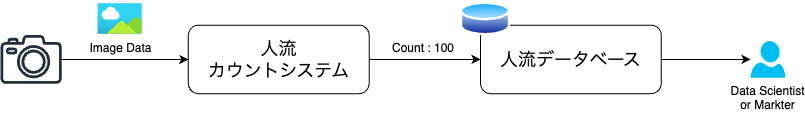
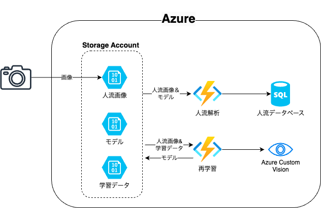

# ML OPS with Custom Vision

## 概要

本レポジトリは各カメラから取得される人流情報を防犯や空調の最適化に活かすことを想定したアプリケーションです。



### 複数のカメラを用いたシステムの課題

カメラシステムを実際に運用する上で、設置条件は個体毎に異なります。
これにより、カメラ毎の認識精度がばらつくと想定されます。
例えば、暗所による撮影における感度自動制御で、下図のようなノイズが生じます。
(感度自動制御とはカメラ信号処理の一部で、適正な明るさが得られない場合などに電気的に信号を増幅させることで適正な明るさの画像を得る処理のことです。)
同じカメラにおいても長期期間システムを運用するうえでは、季節や周辺環境の変化により影響度が変化します。

このカメラの精度ばらつきが人流情報の効果的な利用の問題になると考えられます。


### アーキテクチャ

以下の構成で認識精度のばらつきを自動的に補正します。



## デプロイ

### Terraform

`./terraform/terraform.tfvars.sample`を`.sample`を外し、必要事項を記入します。
その上で terraform で Azure 環境を構築します。

```
cd terraform
terraform init
terraform plan
terraform apply
```

## ローカル実行

以下の環境を構築あらかじめ用意します。

- python
- Azure CLI および Azure Core Tool

`./src/local.settings.json.sample`を`.sample`を外し、StorageConnection を記入します。
その上で以下のコマンドを実行します。

```
cd src
func start
```
